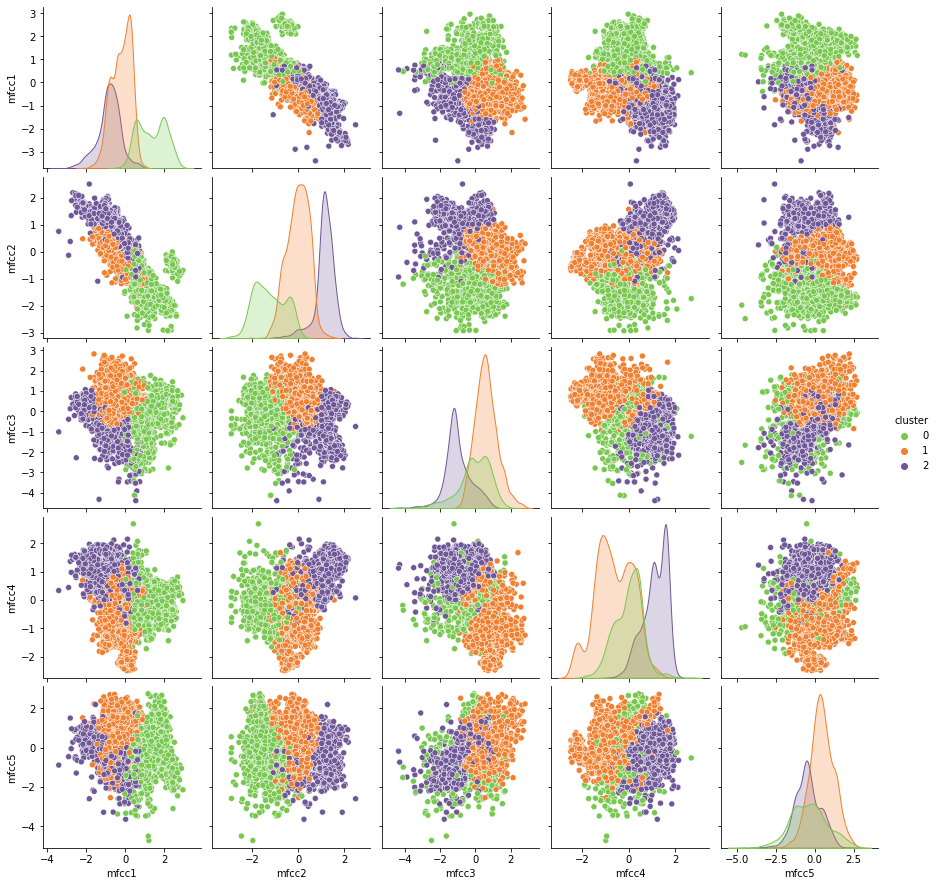

# Machine conditions monitoring

## Description

The main objective of this project is to analyse different machine learning models and create the best machine learning model that will be able to monitor the operations and identify anomalies in sound patterns.

We have audio files for 4 different machines. And each machine has normal and abnormal sound files. With the help of these files we have to create a machine learning model which is able to detect abnormal conditions.

The dataset used for this project can be downloaded from [link](https://zenodo.org/record/3384388#.YFIrNXnvJEY).


## Installation

Python 3 should be install in you system.
To install python you can follow the link [Install Python](https://realpython.com/installing-python/#how-to-install-python-on-macos)
You can find the libraries that are required in `requirements.txt`

## Usage
- Run collect_data.py to get the dataset from audio file and create csv file with below command:
`python collect_data.py`

- For creating model for different machines:
    -Run `machine_monitoring_fan.ipynb` for analysis and model creation for machine type fan.
    -Run `machine_monitoring_pump.ipynb` for analysis and model creation for machine type pumps.
    -Run `machine_monitoring_slider.ipynb` for analysis and model creation for machine type sliders.
    -Run `machine_monitoring_valve.ipynb` for analysis and model creation for machine type valves.


## Repo Architecture
```
machine-monitoring-clustering
│__   
│   assets              :contains the data files and images
│   │__
│   │   data            :contains dataset
│   │__
│   │   images          :contains images used in README_file
│
│   README.md                       :explains the project
│   collect_data.py                 :this file will create dataset with audio file for training and testing model 
│   machine_monitoring_fan.ipynb    :this will contain the list of all the normal audio file path and machine type 
│   machine_monitoring_fan.ipynb    :this file will create model and validate it with validation data
│   machine_monitoring_fan.ipynb    :this is model which you can load for machine monitoring
│   machine_monitoring_fan.ipynb    :this notebook contains the observation on normal audio file
│   README.md                   :explains the project
│   requirements.txt            :contains list of python libraries required to run the project

```

## Visuals

Sample clustering plot that we got after creating Kmean cluster on slider data.



## Report

For Detailed analysis report you can check the [link](Report.pdf).

## Contributors 

This project is a cooperation of the following team:

- [Reena](https://github.com/reenakoshta10)

## Timeline 

December 2021.
We had about 3 days for this challenge. We began our journey by understanding the challenge, what a sound was made of and the important features of sound. Then we made a script that organized the data. After that we modeled the data. 
